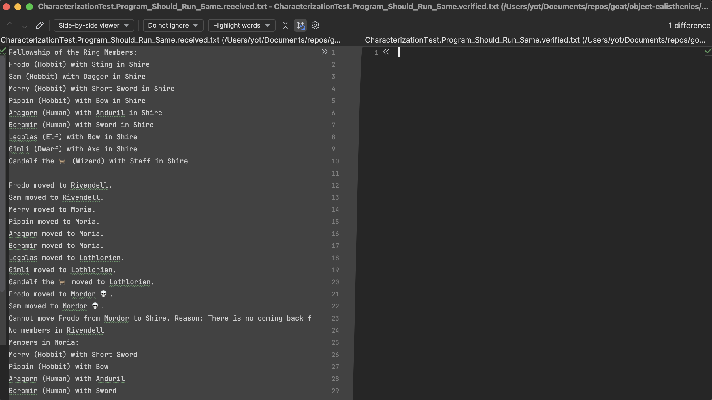
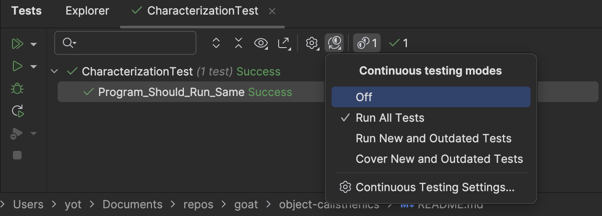
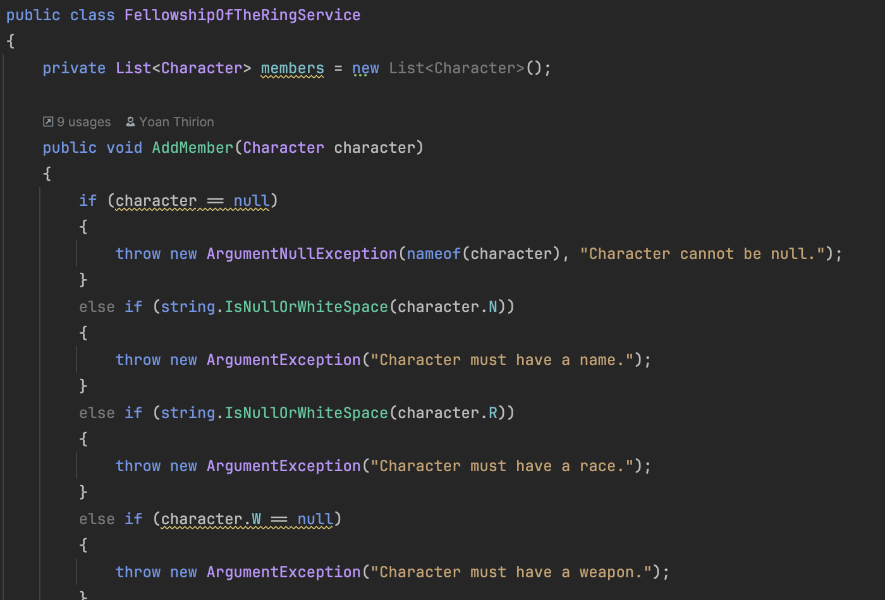
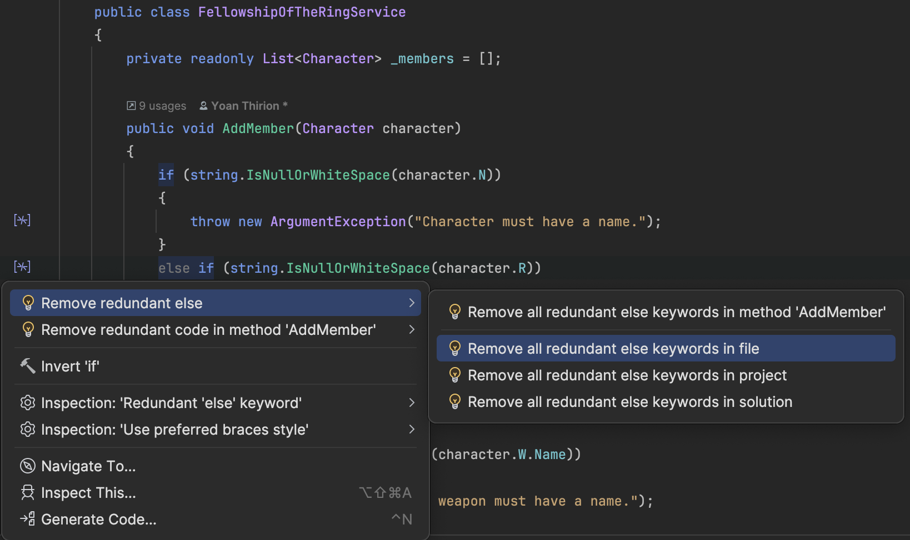
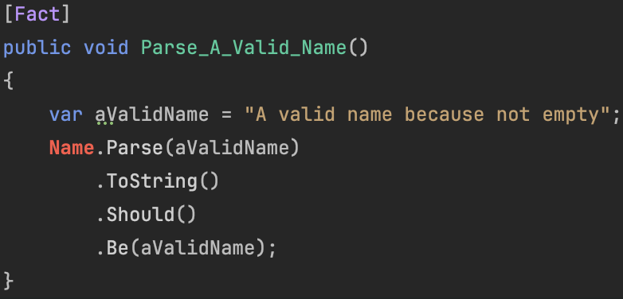
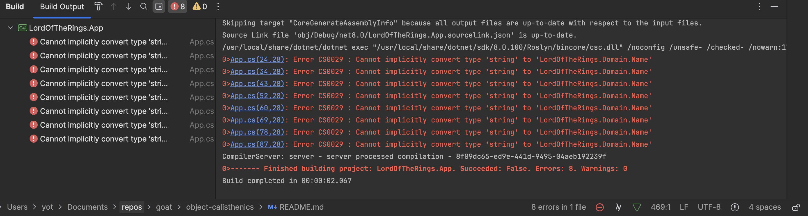
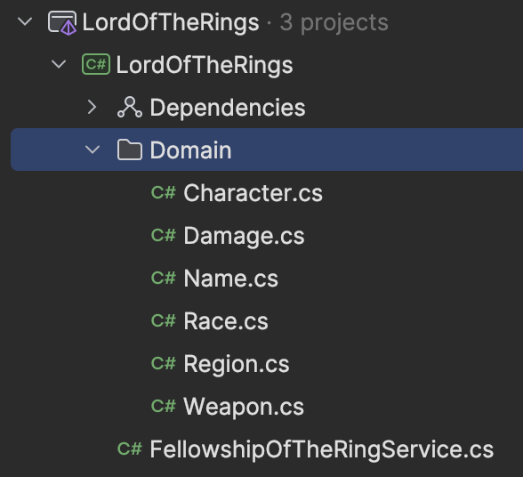
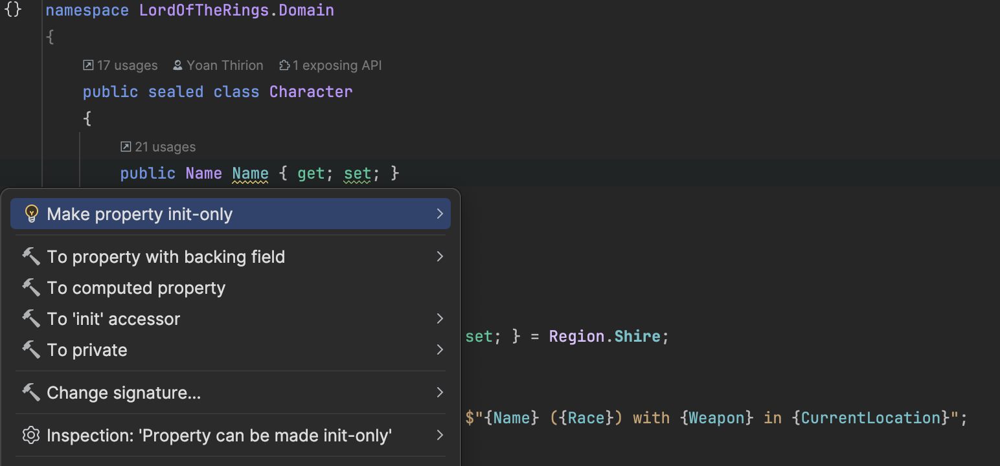

# Object Calisthenics Refactoring
## Object Calisthenics
Let's explore the Object Calisthenics that are violated in the current version of the `FellowshipOfTheRingService` and other smells:

```csharp
 public class FellowshipOfTheRingService
{
    // First Class Collections
    private List<Character> members = new List<Character>();

    public void AddMember(Character character)
    {
        // Useless check here
        if (character == null)
        {
            throw new ArgumentNullException(nameof(character), "Character cannot be null.");
        }
        // Don't Abbreviate: many times
        // What is N? Name from the Exception message...
        else if (string.IsNullOrWhiteSpace(character.N))
        {
            throw new ArgumentException("Character must have a name.");
        }
        // Don't use the ELSE keyword: many times in this method
        else if (string.IsNullOrWhiteSpace(character.R))
        {
            throw new ArgumentException("Character must have a race.");
        }
        // Null check everywhere
        else if (character.W == null)
        {
            throw new ArgumentException("Character must have a weapon.");
        }
        // One Dot Per Line: many times
        else if (string.IsNullOrWhiteSpace(character.W.Name))
        {
            throw new ArgumentException("A weapon must have a name.");
        }
        else if (character.W.Damage <= 0)
        {
            throw new ArgumentException("A weapon must have a damage level.");
        }
        else
        {
            // Only One Level Of Indentation Per Method
            bool exists = false;
            foreach (var member in members)
            {
                // No Getters/Setters/Properties
                if (member.N == character.N)
                {
                    exists = true;
                    break;
                }
            }

            if (exists)
            {
                // Exceptions everywhere...
                throw new InvalidOperationException(
                    "A character with the same name already exists in the fellowship.");
            }
            else
            {
                members.Add(character);
            }
        }
    }

    // Wrap All Primitives And Strings
    public void UpdateCharacterWeapon(string name, string newWeapon, int damage)
    {
        foreach (var character in members)
        {
            if (character.N == name)
            {
                // Anemic objects
                character.W = new Weapon
                {
                    // No Getters/Setters/Properties...
                    Name = newWeapon,
                    Damage = damage
                };
                break;
            }
        }
    }
    ...
}
```

Already a lot of smells in these 2 methods...

## Characterization Test
Before refactoring this code, let's cover the existing software.
We will protect existing behavior of this code against unintended changes through automated testing.

The `Program` is writing a lot of stuff in the `Console` (behavior calls, object states).

```text
Fellowship of the Ring Members:
Frodo (Hobbit) with Sting in Shire
Sam (Hobbit) with Dagger in Shire
Merry (Hobbit) with Short Sword in Shire
Pippin (Hobbit) with Bow in Shire
Aragorn (Human) with Anduril in Shire
Boromir (Human) with Sword in Shire
Legolas (Elf) with Bow in Shire
Gimli (Dwarf) with Axe in Shire
Gandalf the 🐐 (Wizard) with Staff in Shire

Frodo moved to Rivendell.
Sam moved to Rivendell.
Merry moved to Moria.
Pippin moved to Moria.
Aragorn moved to Moria.
Boromir moved to Moria.
Legolas moved to Lothlorien.
Gimli moved to Lothlorien.
Gandalf the 🐐 moved to Lothlorien.
Frodo moved to Mordor 💀.
Sam moved to Mordor 💀.
Cannot move Frodo from Mordor to Shire. Reason: There is no coming back from Mordor.
No members in Rivendell
Members in Moria:
Merry (Hobbit) with Short Sword
Pippin (Hobbit) with Bow
Aragorn (Human) with Anduril
Boromir (Human) with Sword
Members in Lothlorien:
Legolas (Elf) with Bow
Gimli (Dwarf) with Axe
Gandalf the 🐐 (Wizard) with Staff
Members in Mordor:
Frodo (Hobbit) with Sting
Sam (Hobbit) with Dagger
No members in Shire
```

We will cover this behavior by using [Verify](https://github.com/VerifyTests/Verify). 

```csharp
dotnet add package Verify.Xunit --version 26.1.2
```

🔴 Let's add a test on the Program
- We have to introduce a method to encapsulate the behavior in the current `Program` file.

```csharp
public class CharacterizationTest
{
    private readonly StringWriter _console;

    public CharacterizationTest()
    {
        // Use a StringWriter for the Console Output
        _console = new StringWriter();
        // Set the Out for the Console
        Console.SetOut(_console);
    }

    [Fact]
    public Task Program_Should_Run_Same()
    {
        App.Run();
        // Simply call Verify that compares the received and the verified files
        return Verify(_console.ToString());
    }
}
```

At the first run it fails:


🟢 We verify the behavior by simply copying the content of the `received` file in the `verified` one

## Surface Refactoring
Let's use our `IDE` to refactor automatically the code to reduce a little bit its complexity.
We activate `Continuous Testing Mode` to assess that we do not break the existing behaviors with those changes.



We start by taking good care of the feedback provided:



Here is some of the refactorings applied:
- Delete unreachable code
- Remove useless method
- Remove redundant else keywords 
- Introduce Constant
- Convert to `LinQ` expression (`ToString`)



And the code now looks like:

```csharp
public class FellowshipOfTheRingService
{
    private const string Mordor = "Mordor";
    private readonly List<Character> _members = [];

    public void AddMember(Character character)
    {
        if (string.IsNullOrWhiteSpace(character.N))
        {
            throw new ArgumentException("Character must have a name.");
        }
        if (string.IsNullOrWhiteSpace(character.R))
        {
            throw new ArgumentException("Character must have a race.");
        }
        if (character.W == null)
        {
            throw new ArgumentException("Character must have a weapon.");
        }
        if (string.IsNullOrWhiteSpace(character.W.Name))
        {
            throw new ArgumentException("A weapon must have a name.");
        }
        if (character.W.Damage <= 0)
        {
            throw new ArgumentException("A weapon must have a damage level.");
        }
        
        var exists = false;
        foreach (var member in _members)
        {
            if (member.N == character.N)
            {
                exists = true;
                break;
            }
        }

        if (exists)
        {
            throw new InvalidOperationException(
                "A character with the same name already exists in the fellowship.");
        }

        _members.Add(character);
    }

    public void RemoveMember(string name)
    {
        Character? characterToRemove = null;
        foreach (var character in _members)
        {
            if (character.N == name)
            {
                characterToRemove = character;
                break;
            }
        }

        if (characterToRemove == null)
        {
            throw new InvalidOperationException($"No character with the name '{name}' exists in the fellowship.");
        }

        _members.Remove(characterToRemove);
    }

    public void MoveMembersToRegion(List<string> memberNames, string region)
    {
        foreach (var name in memberNames)
        {
            foreach (var character in _members)
            {
                if (character.N != name) continue;
                
                if (character.C == Mordor && region != Mordor)
                {
                    throw new InvalidOperationException(
                        $"Cannot move {character.N} from Mordor to {region}. Reason: There is no coming back from Mordor.");
                }

                character.C = region;
                    
                Console.WriteLine(region != Mordor
                    ? $"{character.N} moved to {region}."
                    : $"{character.N} moved to {region} 💀.");
            }
        }
    }

    public void PrintMembersInRegion(string region)
    {
        List<Character> charactersInRegion = new List<Character>();
        foreach (var character in _members)
        {
            if (character.C == region)
            {
                charactersInRegion.Add(character);
            }
        }

        if (charactersInRegion.Count > 0)
        {
            Console.WriteLine($"Members in {region}:");
            foreach (var character in charactersInRegion)
            {
                Console.WriteLine($"{character.N} ({character.R}) with {character.W.Name}");
            }
        }
        else if (charactersInRegion is [])
        {
            Console.WriteLine($"No members in {region}");
        }
    }

    public override string ToString() 
        => _members.Aggregate("Fellowship of the Ring Members:\n", (current, member) => current + $"{member.N} ({member.R}) with {member.W.Name} in {member.C}\n");
}
```

## Don't Abbreviate
We adapt the code from the caller `FellowshipOfTheRingService`.
Abbreviations were declared in the `Character` class:

```csharp
public sealed class Character
{
    public string Name { get; set; }
    public string Race { get; set; }
    public Weapon Weapon { get; set; }
    public string CurrentLocation { get; set; } = "Shire";
}
```

## Wrap All Primitives And Strings
There are plenty of Primitives used in the `Domain`...
We can use the [`Sprout` Technique](https://understandlegacycode.com/blog/key-points-of-working-effectively-with-legacy-code/#1-the-sprout-technique) to design new types using [T.D.D](https://tidyfirst.substack.com/p/canon-tdd).
It means that we will design our types on the side of the production code.

The interest of those types is to make impossible to instantiate an object in an invalid state.
To do so, let's apply [`Parse Don't Validate`](https://lexi-lambda.github.io/blog/2019/11/05/parse-don-t-validate/) technique to design our code.

### Name
`Name` is a `string` let's design a new class containing a parsing method.

🔴 Add a first test:

```csharp
[Fact]
public void Parse_A_Valid_Name()
{
    var aValidName = "A valid name because not empty";
    // Name will contain a Parse method with this signature: string -> Name (or Exception 😱)
    // We will go back to exceptions in a few steps
    Name.Parse(aValidName)
        .ToString()
        .Should()
        .Be(aValidName);
}
```

It is red because, the code does not compile:



🟢 We generate the class from the test and iterate on it to math the test pass

```csharp
public sealed class Name
{
    private readonly string _value;
    private Name(string value) => _value = value;
    // Parse is the only way to instantiate it (Factory Method)
    public static Name Parse(string value) => new(value);
    public override string ToString() => _value;
}
```

🔵 We can refactor our test to use a [`property`](https://xtrem-tdd.netlify.app/Flavours/Testing/pbt) instead of an example

We may express this property like this
```text
for any non empty text
such that parseName is successfull 
```

We use `FsCheck` and results in:

```csharp
// Express how to generate valid names
private static Arbitrary<string> NonEmptyString() => Arb.Default.String()
    .Filter(str => !string.IsNullOrWhiteSpace(str));

[Fact]
public void Parse_A_Valid_Name()
    => Prop.ForAll(
        NonEmptyString(),
        validName => Name.Parse(validName).ToString() == validName)
        .QuickCheckThrowOnFailure();
```

🔴 Let's add a second test

```csharp
[Fact]
public void Fail_To_Parse_Empty_Name()
{
    var act = () => Name.Parse(string.Empty);
    act.Should()
        .Throw<ArgumentException>()
        .WithMessage("A name can not be empty.");
}
```

🟢 Let's adapt the `Name` class

```csharp
public static Name Parse(string value)
{
    if (string.IsNullOrWhiteSpace(value))
    {
        throw new ArgumentException("A name can not be empty.");
    }
    return new Name(value);
}
```

We finish by adding `Equality` on this type and and an extension method on `string`:

```csharp
public sealed class Name
{
    private readonly string _value;
    private Name(string value) => _value = value;
    public static Name Parse(string value)
    {
        if (string.IsNullOrWhiteSpace(value))
        {
            throw new ArgumentException("A name can not be empty.");
        }
        return new Name(value);
    }

    public override string ToString() => _value;
    
    #region Equality operators

    private bool Equals(Name other) => _value == other._value;
    public override bool Equals(object? obj) => ReferenceEquals(this, obj) || obj is Name other && Equals(other);
    public override int GetHashCode() => _value.GetHashCode();

    #endregion
}

public static class NameExtensions
{
    public static Name ToName(this string value) => Name.Parse(value);
}
```

We are now ready to use it in the production code.
To do so, we change the type in the `Character` class:

```csharp
public sealed class Character
{
    public Name Name { get; set; }
    public string Race { get; set; }
    public Weapon Weapon { get; set; }
    public string CurrentLocation { get; set; } = "Shire";
}
```

Then, the compiler helps us to move on:



We adapt the production code that looks like this now:
```csharp
public static void Run()
{
    var fellowship = new FellowshipOfTheRingService();

    try
    {
        fellowship.AddMember(new Character
        {
            Name = "Frodo".ToName(), Race = "Hobbit", Weapon = new Weapon
            {
                Name = "Sting",
                Damage = 30
            }
        });

        fellowship.AddMember(new Character
        {
            Name = "Sam".ToName(), Race = "Hobbit", Weapon = new Weapon
            {
                Name = "Dagger",
                Damage = 10
            }
        });
        ...
```

### Race
Let's move on another `string` used in the system: `Race`.
Here, there is a finite number of possible values and yet it is expressed as an infinite one: `string`.

Let's use an `enum` to represent the possible values:

```csharp
public enum Race
{
    Hobbit,
    Human,
    Elf,
    Dwarf,
    Wizard
}
```

### After a few iterations
After having created dedicated types for primitives and string for our `Domain` it looks like this:



It expresses way much what is going on and we have remove a lot of code from the `Service` (Guard clauses):

```csharp
public void AddMember(Character character)
{
    var exists = false;
    foreach (var member in _members)
    {
        if (member.Name == character.Name)
        {
            exists = true;
            break;
        }
    }

    if (exists)
    {
        throw new InvalidOperationException(
            "A character with the same name already exists in the fellowship.");
    }

    _members.Add(character);
}
```

The remaining primitive types in the `Service` are coming from the outside world and needs to be parsed.
We may encapsulate those in command objects to make it more cohesive (let's keep it in mind for later on).

```csharp
// Why is a domain object passed here?
public void AddMember(Character character)
public void RemoveMember(string name)
public void MoveMembersToRegion(List<string> memberNames, string region)
public void PrintMembersInRegion(string region)
```

## First Class Collections
We may create a `First class collection` to manage fellowship members and encapsulate the business behavior leaked in the `FellowshipOfTheRingService`:

```csharp
private readonly List<Character> _members = [];

public void AddMember(Character character)
{
    // Those kind of behaviors should be encapsultaed in the Domain...
    var exists = false;
    foreach (var member in _members)
    {
        if (member.Name == character.Name)
        {
            exists = true;
            break;
        }
    }

    if (exists)
    {
        throw new InvalidOperationException(
            "A character with the same name already exists in the fellowship.");
    }

    _members.Add(character);
}
```

As in the previous step, we use the `Sprout Technique` to design our new `Collection` that will contain the contract below:

🔴 We start with a test on `AddMember`

```csharp
[Fact]
public void Add_New_Member()
    => _fellowship
        .AddMember(_frodo)
        .ToString()
        .Should()
        .Be("Fellowship of the Ring Members:\nFrodo (Hobbit) with Sting in Shire\n");
```

We design a [`Test Data Builder`](https://xtrem-tdd.netlify.app/Flavours/Testing/test-data-builders) to instantiate `Character` and create a single way of creating those from our tests.
If its design changes (it will at one point: `No Getters/Setters/Properties`), it makes easy to adapt our tests.

```csharp
public class CharacterBuilder
{
    private readonly string _name;
    private Race? _race;
    private string? _weapon;
    private CharacterBuilder(string name) => _name = name;

    public static CharacterBuilder ACharacter(string name) => new(name);
    public CharacterBuilder Hobbit() => Act(() => _race = Race.Hobbit);
    public CharacterBuilder With(string weapon) => Act(() => _weapon = weapon);

    private CharacterBuilder Act(Action action)
    {
        action();
        return this;
    }

    public Character Build() => new()
    {
        Name = _name.ToName(), Race = _race ?? Race.Hobbit,
        Weapon = new Weapon
        {
            Name = (_weapon ?? "String").ToName(),
            // Use Faker.Net for the data which are not impacting the output of our tests
            Damage = Faker.RandomNumber.Next(0, 200).ToDamage()
        }
    };
}
```

Our test is still red and looks like this:

```csharp
namespace LordOfTheRings.Tests.Domain
{
    public class FellowshipShould
    {
        private readonly Character _frodo = CharacterBuilder
            .ACharacter("Frodo")
            .Hobbit()
            .Build();

        private readonly Fellowship _fellowship = new();

        [Fact]
        public void Add_New_Member()
            => _fellowship
                .AddMember(_frodo)
                .ToString()
                .Should()
                .Be("Fellowship of the Ring Members:\nFrodo (Hobbit) with Sting in Shire\n");
    }

    internal class Fellowship
    {
        // We choose to return Fellowship to chain calls 
        public Fellowship AddMember(Character character)
        {
            throw new NotImplementedException();
        }
    }
}
```

🟢 We make it pass by implementing the `ToString` method and using a `HashSet` to manage the members 

```csharp
internal class Fellowship
{
    private readonly HashSet<Character> _members = [];

    public Fellowship AddMember(Character character)
    {
        _members.Add(character);
        return this;
    }

    public override string ToString()
        => _members.Aggregate("Fellowship of the Ring Members:\n", (current, member) => current + (member + "\n"));
}

public sealed class Character
{
    ...
    public override string ToString() => $"{Name} ({Race}) with {Weapon} in {CurrentLocation}";
}
```

Not that much to refactor here.

🔴 Let's add a second test that will represent its behavior when trying to add an existing member

```csharp
[Fact]
public void Add_Existing_Member_Fails()
{
    var addFrodoTwice = () => _fellowship
        .AddMember(_frodo)
        .AddMember(_frodo);
    
    addFrodoTwice.Should()
        .Throw<InvalidOperationException>()
        .WithMessage("A character with the same name already exists in the fellowship.");
}
```

🟢 We use the feature offered by `HashSet` to do so:

```csharp
public Fellowship AddMember(Character character)
{
    if (!_members.Add(character))
    {
        throw new InvalidOperationException(
            "A character with the same name already exists in the fellowship.");
    }
    return this;
}
```

### After a few iterations
Our tests are looking like this:

```csharp
public class FellowshipShould
{
    private readonly Character _frodo = CharacterBuilder
        .ACharacter("Frodo")
        .Hobbit()
        .Build();

    private readonly Character _gandalf =
        CharacterBuilder
            .ACharacter("Gandalf the 🐐")
            .With("Staff")
            .Wizard()
            .Build();

    private readonly Character _gimli =
        CharacterBuilder
            .ACharacter("Gimli")
            .With("Axe")
            .Dwarf()
            .In(Region.Mordor)
            .Build();

    private readonly Fellowship _fellowship = new();

    [Fact]
    public void Add_New_Member()
        => _fellowship
            .AddMember(_frodo)
            .ToString()
            .Should()
            .Be("Fellowship of the Ring Members:\nFrodo (Hobbit) with Sting in Shire\n");

    [Fact]
    public void Add_Existing_Member_Fails()
    {
        var addFrodoTwice = () => _fellowship
            .AddMember(_frodo)
            .AddMember(_frodo);

        addFrodoTwice.Should()
            .Throw<InvalidOperationException>()
            .WithMessage("A character with the same name already exists in the fellowship.");
    }

    [Fact]
    public void Remove_Existing_Member()
        => _fellowship
            .AddMember(_frodo)
            .Remove(_frodo.Name)
            .ToString()
            .Should()
            .Be("Fellowship of the Ring Members:\n");

    [Fact]
    public void Move_Members_To_Existing_Region()
        => _fellowship
            .AddMember(_frodo)
            .AddMember(_gandalf)
            .MoveTo(Region.Moria, _frodo.Name, _gandalf.Name)
            .ToString()
            .Should()
            .BeEquivalentTo(
                "Fellowship of the Ring Members:\nFrodo (Hobbit) with Sting in Moria\nGandalf the \ud83d\udc10 (Wizard) with Staff in Moria\n");

    [Fact]
    public void Move_Members_From_Mordor_To_Another_Region_Fails()
    {
        var moveGimliFromMordor = () => _fellowship
            .AddMember(_gimli)
            .MoveTo(Region.Lothlorien, _gimli.Name);

        moveGimliFromMordor
            .Should()
            .Throw<InvalidOperationException>()
            .WithMessage(
                $"Cannot move Gimli from Mordor to Lothlorien. Reason: There is no coming back from Mordor.");
    }


    [Fact]
    public Task Print_Fellowship_Members_By_Region()
    {
        var updatedFellowship = _fellowship
            .AddMember(_frodo)
            .AddMember(_gandalf)
            .AddMember(_gimli);

        var originalConsoleOut = Console.Out;
        var log = new StringWriter();
        Console.SetOut(log);

        updatedFellowship.PrintMembersInRegion(Region.Mordor);
        updatedFellowship.PrintMembersInRegion(Region.Shire);
        updatedFellowship.PrintMembersInRegion(Region.Lothlorien);

        Console.SetOut(originalConsoleOut);

        return Verify(log.ToString());
    }
}
```

And the associated production code:

```csharp
public sealed class Fellowship
{
    private readonly HashSet<Character> _members = [];

    public Fellowship AddMember(Character character)
    {
        if (!_members.Add(character))
        {
            throw new InvalidOperationException(
                "A character with the same name already exists in the fellowship.");
        }

        return this;
    }

    public Fellowship Remove(Name name)
    {
        var characterToRemove = _members.FirstOrDefault(character => character.Name == name);
        if (characterToRemove == null)
        {
            throw new InvalidOperationException($"No character with the name '{name}' exists in the fellowship.");
        }

        _members.Remove(characterToRemove);

        return this;
    }

    public override string ToString()
        => _members.Aggregate("Fellowship of the Ring Members:\n", (current, member) => current + (member + "\n"));

    public Fellowship MoveTo(Region destination, params Name[] names)
    {
        _members.Where(m => names.Contains(m.Name))
            .ToList()
            .ForEach(character => MoveCharacter(character, destination));

        return this;
    }

    private static void MoveCharacter(Character character, Region destination)
    {
        if (character.CurrentLocation == Region.Mordor && destination != Region.Mordor)
        {
            throw new InvalidOperationException(
                $"Cannot move {character.Name} from Mordor to {destination}. Reason: There is no coming back from Mordor.");
        }

        character.CurrentLocation = destination;
        Console.WriteLine(destination != Region.Mordor
            ? $"{character.Name} moved to {destination}."
            : $"{character.Name} moved to {destination} 💀.");
    }

    public void PrintMembersInRegion(Region region)
    {
        var charactersInRegion = _members.Where(m => m.CurrentLocation == region).ToList();

        if (charactersInRegion.Count == 0)
        {
            Console.WriteLine($"No members in {region}");
            return;
        }

        Console.WriteLine($"Members in {region}:");
        foreach (var character in charactersInRegion)
        {
            Console.WriteLine(character);
        }
    }
}
```

### Integrate the First Class collection
We can now plug the collection in the `Service`:

```csharp
public class FellowshipOfTheRingService
{
    // Should be loaded from a Repository
    private readonly Fellowship _fellowship = new();

    public void AddMember(Character character) => _fellowship.AddMember(character);
    public void RemoveMember(string name) => _fellowship.Remove(name.ToName());

    public void MoveMembersToRegion(List<string> memberNames, string region)
        => _fellowship.MoveTo(
            region.ToRegion(),
            memberNames.Select(m => m.ToName()).ToArray()
        );

    public void PrintMembersInRegion(string region) => _fellowship.PrintMembersInRegion(region.ToRegion());
    public override string ToString() => _fellowship.ToString();
}
```

The `Service` is now lighter and its responsibility is to `parse` the inputs and pass them to the `Domain`.
If anything fails the service throws the exception.

## No Getters/Setters/Properties
> Where do we have Getters / Setters?

We can use our `IDE` to start this refactoring:



We end-up with:

```csharp
public sealed class Character(Name name, Race race, Weapon weapon, Region currentLocation = Region.Shire)
{
    public Name Name { get; } = name;
    public Race Race { get; } = race;
    public Weapon Weapon { get; } = weapon;
    public Region CurrentLocation { get; set; } = currentLocation;

    public override string ToString() => $"{Name} ({Race}) with {Weapon} in {CurrentLocation}";
}

public class Weapon(Name name, Damage damage)
{
    public Name Name { get; } = name;
    public override string ToString() => Name.ToString();
}
```

Then adapt the `App`:

```csharp
public static class App
{
    private static readonly FellowshipOfTheRingService Fellowship = new();

    public static void Run()
    {
        try
        {
            AddMember("Frodo", Race.Hobbit, "Sting", 30);
            AddMember("Sam", Race.Hobbit, "Dagger", 10);
            AddMember("Merry", Race.Hobbit, "Short Sword", 24);
            AddMember("Pippin", Race.Hobbit, "Bow", 8);
            AddMember("Aragorn", Race.Human, "Anduril", 100);
            AddMember("Boromir", Race.Human, "Sword", 90);
            AddMember("Legolas", Race.Elf, "Bow", 100);
            AddMember("Gimli", Race.Dwarf, "Axe", 100);
            AddMember("Gandalf the 🐐", Race.Wizard, "Staff", 200);

            ...
    }

    private static void AddMember(
        string name,
        Race race,
        string weapon,
        int damage)
        => Fellowship.AddMember(new Character(name.ToName(), race, new Weapon(weapon.ToName(), damage.ToDamage())));
}
```

And the `CharacterBuilder` (remember the interception point serving as a Façade to instantiate Domain Objects):

```csharp
public Character Build() => new(
    _name.ToName(),
    _race ?? Race.Hobbit,
    new Weapon((_weapon ?? "Sting").ToName(), Faker.RandomNumber.Next(0, 200).ToDamage()),
    _region ?? Region.Shire
);
```

Then, we move the behaviors related to the properties exposed to the `Character` entity:

```csharp
public sealed class Character(Name name, Race race, Weapon weapon, Region currentLocation = Region.Shire)
{
    public void Move(Region destination)
    {
        if (currentLocation == Region.Mordor && destination != Region.Mordor)
        {
            throw new InvalidOperationException(
                $"Cannot move {name} from Mordor to {destination}. Reason: There is no coming back from Mordor.");
        }

        currentLocation = destination;
        Console.WriteLine(destination != Region.Mordor
            ? $"{name} moved to {destination}."
            : $"{name} moved to {destination} 💀.");
    }

    public bool HasName(Name other) => name == other;
    public bool IsIn(Region region) => currentLocation == region;
    public string ToStringWithoutRegion() => $"{name} ({race}) with {weapon}";
    public override string ToString() => $"{ToStringWithoutRegion()} in {currentLocation}";
}
```

We have no more `Getters` nor `Setter` in our code.
> It forced us to push the behaviors inside the business entities related to those behaviors. 

## Remaining calisthenics
- One Dot Per Line
- Don't Use The ELSE Keyword
- Only One Level Of Indentation Per Method
- Keep All Entities Small
- No Classes With More Than Two Instance Variables

By designing codes outside from the current production code and plugging it, we ensure those calisthenics.

## Other refactorings
> What can still be improved?

```csharp
public sealed class Fellowship
{
    private readonly HashSet<Character> _members = [];

    public Fellowship AddMember(Character character)
    {
        if (!_members.Add(character))
        {
            // Should it be really considered as Exceptional situations?
            // Or like a business error?
            throw new InvalidOperationException(
                "A character with the same name already exists in the fellowship.");
        }

        return this;
    }

    public Fellowship Remove(Name name)
    {
        var characterToRemove = _members.FirstOrDefault(character => character.HasName(name));
        if (characterToRemove == null)
        {
            throw new InvalidOperationException($"No character with the name '{name}' exists in the fellowship.");
        }
        _members.Remove(characterToRemove);

        return this;
    }

    public override string ToString()
        => _members.Aggregate("Fellowship of the Ring Members:\n", (current, member) => current + (member + "\n"));

    public Fellowship MoveTo(Region destination, params Name[] names)
    {
        _members
            .Where(character => ContainsCharacter(names, character))
            .ToList()
            .ForEach(character => character.Move(destination));

        return this;
    }

    private static bool ContainsCharacter(Name[] names, Character character)
        => names.ToList().Exists(character.HasName);

    public void PrintMembersInRegion(Region region)
    {
        var charactersInRegion = _members.Where(m => m.IsIn(region)).ToList();

        if (charactersInRegion.Count == 0)
        {
            // Hidden dependencies on Console
            // What if we would like to write into something else?
            // Not really extensible...
            Console.WriteLine($"No members in {region}");
            return;
        }

        Console.WriteLine($"Members in {region}:");

        charactersInRegion
            .ToList()
            .ForEach(character => Console.WriteLine(character.ToStringWithoutRegion()));
    }
}
```

### No more hidden dependencies
We will remove the `Console` dependencies by injecting how to log into the `Collection`.

🔴 Let's add a new test / a new expectation

```csharp
[Fact]
public Task Print_Fellowship_Members_By_Region_Without_Console()
{
    var log = new StringWriter();
    var fellowshipWithoutConsole = new Fellowship();
    
    var updatedFellowship = fellowshipWithoutConsole
        .AddMember(_frodo)
        .AddMember(_gandalf)
        .AddMember(_gimli);

    updatedFellowship.PrintMembersInRegion(Region.Mordor, s => log.WriteLine(s));
    updatedFellowship.PrintMembersInRegion(Region.Shire, s => log.WriteLine(s));
    updatedFellowship.PrintMembersInRegion(Region.Lothlorien, s => log.WriteLine(s));

    return Verify(log.ToString());
}
```

🟢We use the logger in addition to the `Console` (for now)

```csharp
public void PrintMembersInRegion(Region region, Action<string> logger)
{
    var charactersInRegion = _members.Where(m => m.IsIn(region)).ToList();

    if (charactersInRegion.Count == 0)
    {
        logger.Invoke($"No members in {region}");
        Console.WriteLine($"No members in {region}");
        return;
    }

    logger.Invoke($"Members in {region}:");
    Console.WriteLine($"Members in {region}:");

    charactersInRegion
        .ToList()
        .ForEach(character =>
        {
            logger.Invoke(character.ToStringWithoutRegion());
            Console.WriteLine(character.ToStringWithoutRegion());
        });
}
```

🔵 Any improvement?

We can simulate logging to remove nullable logger field and use an alias for `Logger`:

```csharp
using Logger = Action<string>;
    
public sealed class Fellowship
{
    public void PrintMembersInRegion(Region region)
    {
        var charactersInRegion = _members.Where(m => m.IsIn(region)).ToList();

        if (charactersInRegion.Count == 0)
        {
            _logger($"No members in {region}");
            Console.WriteLine($"No members in {region}");
            return;
        }

        _logger($"Members in {region}:");
        Console.WriteLine($"Members in {region}:");

        charactersInRegion
            .ToList()
            .ForEach(character =>
            {
                _logger(character.ToStringWithoutRegion());
                Console.WriteLine(character.ToStringWithoutRegion());
            });
    }
```

Then we use the `Logger` in the entire system through constructor injection in the `Service` and `method` injection in the `Character` entity.

```csharp
public class FellowshipOfTheRingService(Logger logger)
{
    ...
        
    public void MoveMembersToRegion(List<string> memberNames, string region)
        => _fellowship.MoveTo(
            region.ToRegion(),
            logger,
            memberNames.Select(m => m.ToName()).ToArray()
        );

    public void PrintMembersInRegion(string region) =>
        _fellowship.PrintMembersInRegion(region.ToRegion(), logger);
    
    ...
}

public sealed class Fellowship()
{
    ...
    public Fellowship MoveTo(Region destination, Logger logger, params Name[] names)
    {
        _members
            .Where(character => ContainsCharacter(names, character))
            .ToList()
            .ForEach(character => character.Move(destination, logger));

        return this;
    }

    ...
        
    public void PrintMembersInRegion(Region region, Logger logger)
    {
        var charactersInRegion = _members.Where(m => m.IsIn(region)).ToList();

        if (charactersInRegion.Count == 0)
        {
            logger($"No members in {region}");
            return;
        }

        logger($"Members in {region}:");

        charactersInRegion
            .ToList()
            .ForEach(character => logger(character.ToStringWithoutRegion()));
    }
}

public sealed class Character(Name name, Race race, Weapon weapon, Region currentLocation = Region.Shire)
{
    public void Move(Region destination, Logger logger)
    {
        ...
    }
    ...
}
```

### No more `Exceptions`
We will use monads to remove exceptions and make our code more explicit.
More explanations about it [here](https://xtrem-tdd.netlify.app/Flavours/Design/avoid-exceptions).

We make it explicit that failure can arise on each method by returning: `Either<Error, Fellowship>` from [LanguageExt](https://github.com/louthy/language-ext).

🔴 We start by adapting a first test

```csharp
[Fact]
public void Add_Existing_Member_Fails()
    => _fellowship
        .AddMemberWithMonad(_frodo)
        .Bind(f => f.AddMemberWithMonad(_frodo))
        .Should()
        .BeLeft(err => err.Message
            .Should()
            .Be("A character with the same name already exists in the fellowship.")
        );
```

🟢 We make it pass

```csharp
public Either<Error, Fellowship> AddMemberWithMonad(Character character)
    => !_members.Add(character)
        ? Error.New("A character with the same name already exists in the fellowship.")
        : this;
```

We continue by plugging the `AddMember` callers to this new method.

After a few iterations our `Fellowship` class looks like this:

```csharp
using LanguageExt;
using LanguageExt.Common;

namespace LordOfTheRings.Domain
{
    public sealed class Fellowship()
    {
        private readonly System.Collections.Generic.HashSet<Character> _members = [];

        public Either<Error, Fellowship> AddMember(Character character)
            => !_members.Add(character)
                ? Error.New("A character with the same name already exists in the fellowship.")
                : this;

        public Either<Error, Fellowship> Remove(Name name)
        {
            var characterToRemove = _members.FirstOrDefault(character => character.HasName(name));

            if (characterToRemove == null)
                return Error.New($"No character with the name '{name}' exists in the fellowship.");

            _members.Remove(characterToRemove);
            return this;
        }

        public override string ToString()
            => _members.Aggregate("Fellowship of the Ring Members:\n", (current, member) => current + (member + "\n"));

        public Either<Error, Fellowship> MoveTo(Region destination, Logger logger, params Name[] names)
        {
            var membersToMove = _members.Where(character => ContainsCharacter(names, character));
            var results = membersToMove.Select(character => character.Move(destination, logger));
            var errors = results.Where(r => r.IsLeft).ToList();

            return errors.Count != 0
                ? errors.First().Map(_ => this)
                : this;
        }

        private static bool ContainsCharacter(Name[] names, Character character)
            => names.ToList().Exists(character.HasName);

        public void PrintMembersInRegion(Region region, Logger logger)
        {
            var charactersInRegion = _members.Where(m => m.IsIn(region)).ToList();

            if (charactersInRegion.Count == 0)
            {
                logger($"No members in {region}");
                return;
            }

            logger($"Members in {region}:");

            charactersInRegion
                .ToList()
                .ForEach(character => logger(character.ToStringWithoutRegion()));
        }
    }
}
```

At the `Service` level, we don't want to leak elements from our `Domain` and returns `Unit` in case of `Right`:

```csharp
public class FellowshipOfTheRingService(Logger logger)
{
    private readonly Fellowship _fellowship = new();

    public Either<Error, Unit> AddMember(Character character)
        => _fellowship.AddMember(character).Map(_ => Unit.Default);

    public Either<Error, Unit> RemoveMember(string name)
        => name.ToName()
            .Bind(n => _fellowship.Remove(n))
            .Match(_ => { }, err => logger(err.Message));

    public Either<Error, Unit> MoveMembersToRegion(List<string> memberNames, string region)
        => _fellowship.MoveTo(
            region.ToRegion(),
            logger,
            memberNames.Select(m => m.ToName()).Rights().ToArray()
        ).Match(_ => { }, err => logger(err.Message));

    public void PrintMembersInRegion(string region) =>
        _fellowship.PrintMembersInRegion(region.ToRegion(), logger);

    public override string ToString() => _fellowship.ToString();
}
```

We have no more `Exceptions` here, but we have still some of them in our wrap types like `Damage` or `Name`.
Let's represent the `parsing` result in the same way.

```csharp
public sealed class Damage : IEquatable<Damage>
{
    private readonly int _value;
    private Damage(int value) => _value = value;

    public static Either<Error, Damage> Parse(int value)
        => value < 0
            ? Error.New("A damage can not be negative")
            : new Damage(value);
    ...
}

public sealed class Name : IEquatable<Name>
{
    private readonly string _value;
    private Name(string value) => _value = value;

    public static Either<Error, Name> Parse(string value)
        => string.IsNullOrWhiteSpace(value)
            ? Error.New("A name can not be empty.")
            : new Name(value);
    ...
}
```

### Use `LanguageExt` collections
We can use lib collections inside the `Fellowship`:

```csharp
public sealed class Fellowship
{
    private Characters _members = [];

    public Either<Error, Fellowship> AddMember(Character character)
        => _members.Find(c => c == character)
            .Map(_ => Error.New("A character with the same name already exists in the fellowship."))
            .ToEither(this)
            .Swap()
            .Do(_ => _members = _members.Add(character));

    public Either<Error, Fellowship> Remove(Name name)
        => _members.Find(character => character.HasName(name))
            .ToEither(Error.New($"No character with the name '{name}' exists in the fellowship."))
            .Do(characterToRemove => _members = _members.Filter(c => c != characterToRemove))
            .Map(_ => this);

    public override string ToString()
        => _members.Fold("Fellowship of the Ring Members:\n",
            (current, member) => current + (member + "\n")
        );

    public Either<Error, Fellowship> MoveTo(Region destination, Logger logger, params Name[] names)
    {
        var errors = _members
            .Filter(character => ContainsCharacter(names, character))
            .Map(character => character.Move(destination, logger))
            .Lefts();

        return errors.Count != 0
            ? errors[0]
            : this;
    }

    private static bool ContainsCharacter(Name[] names, Character character)
        => names.Exists(character.HasName);

    public void PrintMembersInRegion(Region region, Logger logger)
    {
        var charactersInRegion = _members.Filter(m => m.IsIn(region));
        if (charactersInRegion.Count == 0)
        {
            logger($"No members in {region}");
            return;
        }

        logger($"Members in {region}:");

        charactersInRegion
            .ToList()
            .ForEach(character => logger(character.ToStringWithoutRegion()));
    }
}
```

Here is ending our journey.

> What did you think about it?
> What would you do differently?