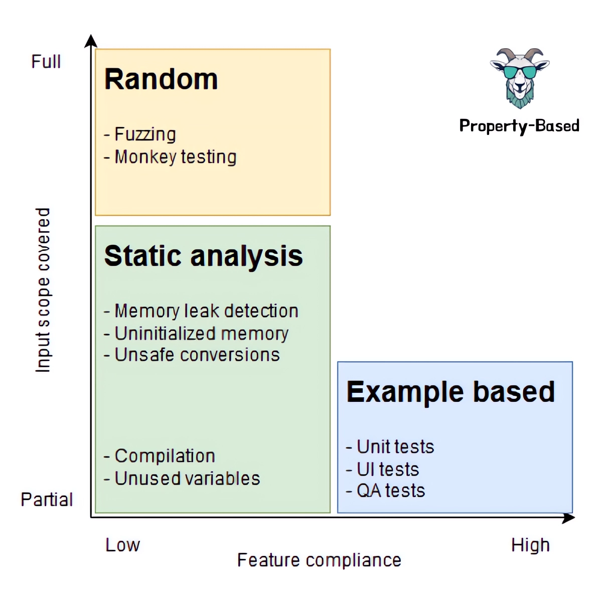
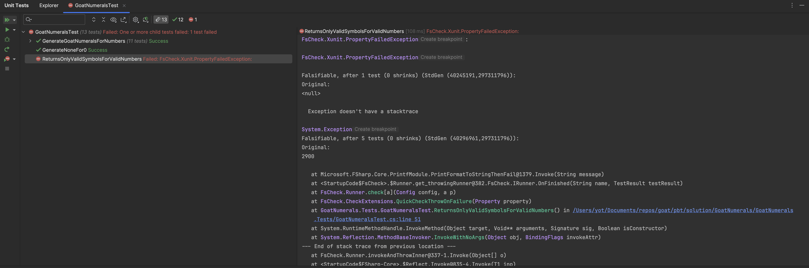
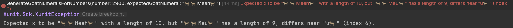
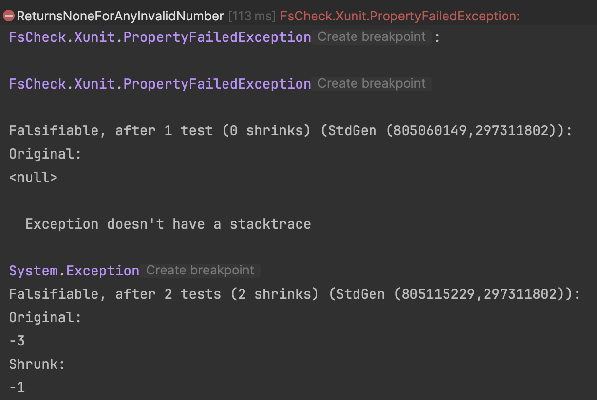

# Unraveling the Power of Property-Based Testing in Unveiling our Own Biases
With this article I would like to address an often-overlooked aspect of our craft: our inherent biases in test case identification and, consequently, in the production code we craft.

As `Alberto Brandolini` aptly put it:
> "It is not the domain experts' knowledge that goes into production; it is the assumption of the developers that goes into production."

This insight strikes a chord, highlighting a truth we often sidestep: **We are all biased when identifying test cases and so when implementing production code**.

> How can we fight them?

## Different kinds of tests
Before talking about [`Property-Based Testing`](https://xtrem-tdd.netlify.app/Flavours/Testing/pbt), let’s talk about the different test technics we use to check the correctness of our implementations.



Those technics are represented on 2 axis :
- Input scope covered: How much do we cover the scope of possible inputs ? 
- Feature compliance: How much the developed feature is compliant with what is expected ?

Examples are really good to understand requirements :

```gherkin
Given (x, y, ...)
When I [call the subject under test] with (x, y, ...)
Then I expect this (output)
```

Let's illustrate the power of example.

### Example-based on Goat Numerals
Imagine that we need to implement a system that will allow us to translate numbers to `goat numeral language`.
We have worked with some 🐐 business experts and have identified with them the following test list:

```text
1 - M
3 - MMM
4 - MBa
5 - Ba
10 - Meh
13 - MehMMM
50 - Baa
100 - Meeh
500, "Baaa")]
1000 - 🐐
2499 - 🐐🐐MeehBaaaMehMeehMMeh
0 - None
```

The goats count from 1 to 3999, it may remind us something 🤔 

This `test list` serves to us to drive our implementation following [`Canon T.D.D`](https://tidyfirst.substack.com/p/canon-tdd). 
After a few iterations, we may end up with a code that looks like this:

```csharp
private static readonly Dictionary<int, string> IntToGoatNumerals = new()
{
    {1000, "🐐"},
    {900, "Meu🐐"},
    {500, "Baaa"},
    {400, "MeehBaaa"},
    {100, "Meeh"},
    {90, "MehMeeh"},
    {50, "Baa"},
    {40, "MehBaa"},
    {10, "Meh"},
    {9, "MMeh"},
    {5, "Ba"},
    {4, "MBa"},
    {1, "M"}
};

// May return something or none for special case (0 here)
public static Option<string> Convert(int number)
{
    if (number != 0)
    {
        var goatNumerals = new StringBuilder();
        var remaining = number;

        foreach (var toGoat in IntToGoatNumerals)
        {
            while (remaining >= toGoat.Key)
            {
                goatNumerals.Append(toGoat.Value);
                remaining -= toGoat.Key;
            }
        }

        return Some(goatNumerals.ToString());
    }
    else
    {
        return None;
    }
}
```

Our tests (examples) look like this:

```csharp
[Fact]
public void GenerateNoneFor0()
    => Convert(0)
        .Should()
        .BeNone();

[Theory]
[InlineData(1, "M")]
[InlineData(3, "MMM")]
[InlineData(4, "MBa")]
[InlineData(5, "Ba")]
[InlineData(10, "Meh")]
[InlineData(13, "MehMMM")]
[InlineData(50, "Baa")]
[InlineData(100, "Meeh")]
[InlineData(500, "Baaa")]
[InlineData(1000, "🐐")]
[InlineData(2499, "🐐🐐MeehBaaaMehMeehMMeh")]
public void GenerateGoatNumeralsForNumbers(int number, string expectedGoatNumeral)
    => Convert(number)
        .Should()
        .BeSome(x => x.Should().Be(expectedGoatNumeral));
```

We are pretty happy with this implementation because we have followed our `test list`, our stakeholders are happy as well.

Still we have focused only on the input scope we identified and we may have missed something or misunderstood another thing...

Imagine an approach as powerful as Example based testing in terms of feature compliance checking but covering also a much more important numbers of inputs.
That’s the promise behind `Property-Based Testing`.

## Property-Based Testing at Our Rescue
Enter `Property-Based Testing` (PBT), a paradigm shift from our traditional example-based testing. 
Unlike specifying a set of inputs and expected outputs, PBT allows us to define properties our code must adhere to, generating a wide range of test cases that challenge our unconscious biases. 

A property looks like this:
```gherkin
for all (x, y, ...)
such that property (x, y, ...)
is satisfied
```

In other words :
- Describe the input
- Describe a property of the output
- Have the process try a lot of random examples and check if it fails


## Property-Based on Goat Numerals
For instance, when working on `Goat Numerals` we may identify those properties:

```gherkin
for all(numbers)
such as n in n < 1 or n > 3999 holds
convert(invalidNumber) is none

for all(validNumbers)
such as n in [1; 3999] holds
convert(validNumber) contains only sounds in "M, Ba, Meh, Baa, Meeh, Baaa, 🐐"
```

Let's implement those properties using [`FsCheck`](https://fscheck.github.io/FsCheck/).
We add the `nuget` packages:

```shell
Install-Package FsCheck
Install-Package FsCheck.Xunit
```

### Create our First Property: Only Valid Goat Characters
Now that `FsCheck` is installed we can write a first property:

```csharp
// We use a Regex to check the result is valid
[GeneratedRegex("^(?:M|Ba|Meh|Baa|Meeh|Baaa|🐐)+$")]
private static partial Regex ValidGoatRegex();
// We define how our machine can generate valid numbers by using Arb and Gen classes
private static readonly Arbitrary<int> ValidNumbers = Gen.Choose(1, 3999).ToArbitrary();

// We define a new Property using this FsCheck Attribute
[Property]
public void ReturnsOnlyValidSymbolsForValidNumbers() => 
    // for all(validNumbers) such as n in [1; 3999] holds
    Prop.ForAll(ValidNumbers,
            // We call the Convert method for each n value and return true when the string value is valid regarding the Regex
            n => Convert(n).Exists(AllGoatCharactersAreValid))
        // Glue for failing the tests through xUnit
        .QuickCheckThrowOnFailure();

private static bool AllGoatCharactersAreValid(string goatNumber) => ValidGoatRegex().IsMatch(goatNumber);
```

At each run, `FsCheck` will generate new random data:

```text
Run 1 : 1921, 3420, 292, 897, 52, ...
Run 2 : 1229, 1205, 919, 1243, ...
Run 3 : 3466, 644, 2027, 705, ...
```

Let's run it:


It fails after 5 passing values for the value: 2900... meaning one value yields false.
The property is said to be falsified and checking is aborted.

#### What does it mean if a property-test fails?
If the framework manages to find an edge case, there are three possibilities :
- The production code is not correctly implemented
- We are not testing the parameters / property the right way
- The understanding and definition of the property are not corrects

#### Isolate the Edge Case
Once a value falsifies our property, a good practice is to isolate it in a classic Unit Test to investigate.
Let's add this test case:

```csharp
[Theory]
...
// We asked to our goat expert what is expected for 2900
[InlineData(2900, "🐐🐐Meeh🐐")]
public void GenerateGoatNumeralsForNumbers(int number, string expectedGoatNumeral)
    => Convert(number)
        .Should()
        .BeSome(x => x.Should().Be(expectedGoatNumeral));
```

Here is the actual result of the test...



well we have identified a bug in our implementation...

After investigating the code we have found a typo in the `Dictionary` used in the conversion process:

```csharp
private static readonly Dictionary<int, string> IntToGoatNumerals = new()
{
    {1000, "🐐"},
    {900, "Meu🐐"}, // Should be 100.1000 : Meeh🐐
    {100, "Meeh"},
    ...
};
```

After having made this fix our property is now green 🥳

### Create a Second Property: None for Invalid Numbers
This one is even simpler to write:

```csharp
// Define what are invalid numbers
private static readonly Arbitrary<int> InvalidNumbers = Arb.Default.Int32().Filter(x => x is <= 0 or > 3999);

[Property]
public void ReturnsNoneForAnyInvalidNumber()
    // Returns true if convert result is None
    => Prop.ForAll(InvalidNumbers, n => Convert(n).IsNone)
        .QuickCheckThrowOnFailure();
```

As for the first property, this one is quickly falsified (after 2 values):



Indeed, the current implementation is not really well managing the boundaries of the algorithm...

```csharp
public static Option<string> Convert(int number)
{
    // Check only that number is not 0...
    if (number != 0)
    {
        ...
    }
    else
    {
        return None;
    }
}
```

We can easily refactor it to pass our property:

```csharp
public static class GoatNumeralsConverter
{
    private const int Min = 1;
    private const int Max = 3999;

    private static readonly Dictionary<int, string> IntToGoatNumerals = new()
    {
        {1000, "🐐"},
        {900, "Meeh🐐"},
        {500, "Baaa"},
        {400, "MeehBaaa"},
        {100, "Meeh"},
        {90, "MehMeeh"},
        {50, "Baa"},
        {40, "MehBaa"},
        {10, "Meh"},
        {9, "MMeh"},
        {5, "Ba"},
        {4, "MBa"},
        {1, "M"}
    };

    public static Option<string> Convert(int number)
        => IsInRange(number) ? ConvertSafely(number) : None;

    private static bool IsInRange(int number) => number is >= Min and <= Max;

    private static string ConvertSafely(int number)
    {
        var goatNumerals = new StringBuilder();
        var remaining = number;

        foreach (var toGoat in IntToGoatNumerals)
        {
            while (remaining >= toGoat.Key)
            {
                goatNumerals.Append(toGoat.Value);
                remaining -= toGoat.Key;
            }
        }

        return goatNumerals.ToString();
    }
}
```

By using `PBT` we have quickly found 2 bugs in our implementation, imagine what could be the impact of this practice on your own code 🤔

## Conclusion
PBT shines in its ability to unearth edge cases that might elude manual testing, thus preventing potential bugs from sneaking into production.

There are lots of Use Cases with PBT:
- `Idempotence`: Verify operations like resetting a Goat's state are idempotent.
  - PBT can automatically check that multiple applications of the operation do not alter its outcome: `f(f(x)) = f(x)`
  - Examples: `UpperCase`, `Delete`
- `Round Tripping`: For a given process, PBT can ensure that "serializing" and then "deserializing" a Goat object returns to the original state, thus guaranteeing data integrity.
  - `from(to(x)) = x`
  - Examples: `Serialization`, `Conversion`
- `Checking Invariants`: Invariants such as "A Goat's age cannot be negative" can be continuously validated across generated test cases, ensuring the model's integrity.
- `Replacing Parameterized Tests`: Instead of manually crafting tests for boundary conditions—such as exceptions thrown for invalid Goat ages—PBT systematically explores these scenarios.
- `Refactoring` or `Rewriting Code`: PBT assists in validating the new implementation against the old, ensuring behavioral consistency while refactoring or rewriting sections of the codebase.
  - `f(x) = new_f(x)`

- What do you think about it?
- How it could be useful to you? and when?